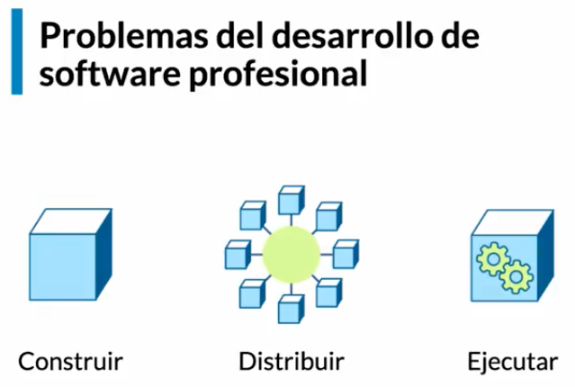
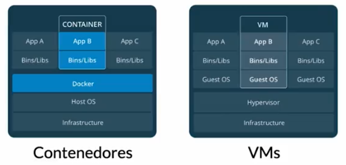
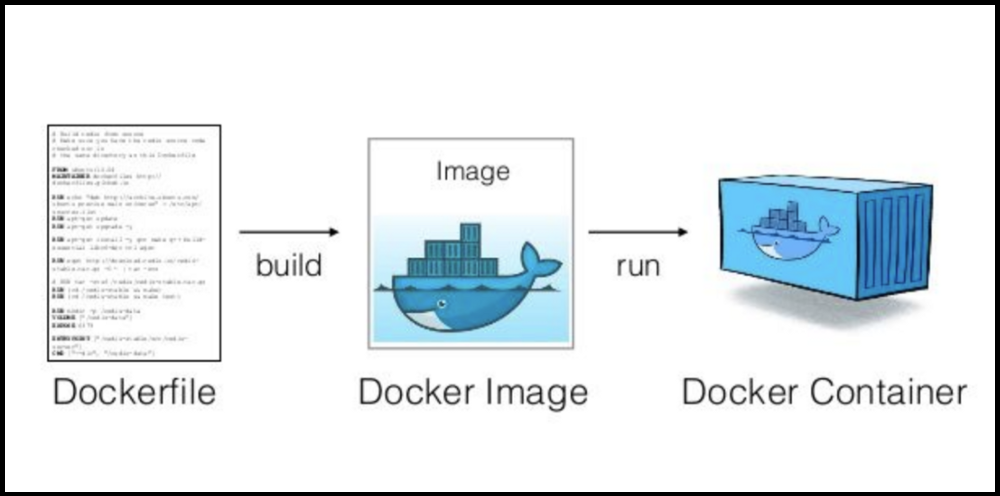
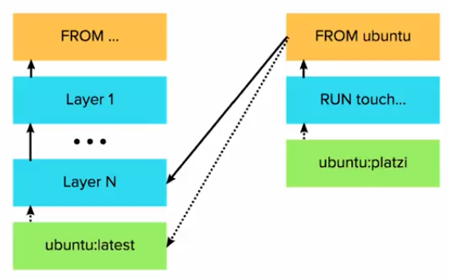

# Docker Platzi

> Docker te permite construir, distribuir y ejecutar cualquier aplicación en cualquier lado
> 





### Problemas al construir software

- Entorno de desarrollo
- Dependencias
- Entorno de Ejecución
- Equivalencia con entorno productivo
- Servicios externos

### Problema al distribuir software

Tu código tiene que transformarse en un artefacto, o varios, que puedan ser transportados a donde tengan que ser ejecutados

- Divergencia de repositorios
- Divergencia de artefactos
- Versionado

### Problema al ejecutar software

La maquina donde escribes el software siempre es distinta a la máquina donde se ejecuta de manera productiva

- Compatibilidad con el entorno productivo
- Dependencias
- Disponibilidad de servicios externos
- Recursos de hardware

### Arquitectura de Docker




### Contenedores

Se puede entender como una maquina virtual liviana. 

- Flexibles
- Bajo acoplamiento
- Seguros
- Livianos
- Escalables
- Portables

```bash
docker container prune
docker run --name alwaysup -d ubuntu tail -f /dev/null
docker exec -it alwaysup
docker inspect --format '{{.State.Pid}}' alwaysup
docker cp demo.txt containername:/testing/test.txt
```

COMMAND: Es el proceso que corre el contenedor al arrancar. Un contenedor corre cuando su proceso principal (main process) esta corriendo

STATUS: Estado del proceso ****

> Containerización es el empleo de contenedores para construir y desplegar software
>

### Imágenes

[GitHub - wagoodman/dive: A tool for exploring each layer in a docker image](https://github.com/wagoodman/dive)

- Artefactos que usa docker para empaquetar contenedores.
- Son las plantillas con las que podemos construir volumenes
- Conjunto de capas

```bash
# Dockerfile
FROM ubuntu:latest
RUN touch /usr/src/hola.txt
```

```bash
docker build -t ubuntu:hola .
docker tag ubuntu:hola j4v13r1t0/ubuntu:hola
docker push j4v13r1t0/ubuntu:hola

docker history redis:alpine
```



### ENTRYPOINT

Comando por defecto que se va a correr siempre y va a utilizar lo que diga CMD como parámetro del ENTRYPOINT

> Utilizar siempre la forma EXEC y no  SHELL
>

### Multi Stage

De una face posterior, podemos acceder a lo que ocurrio en una face anterior